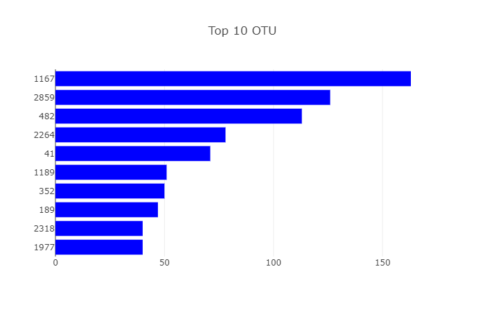
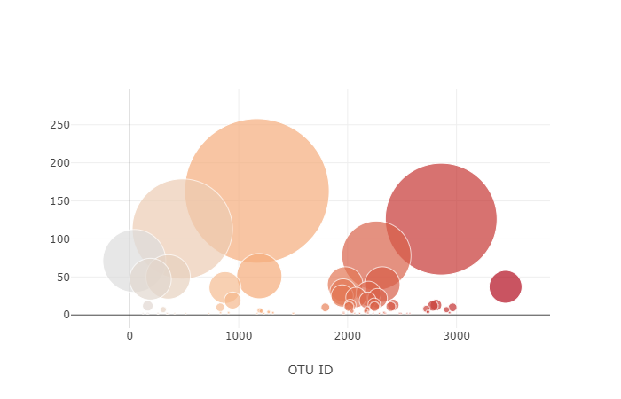
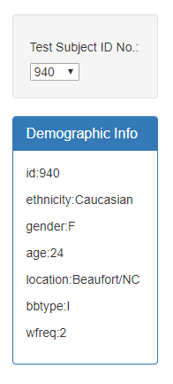
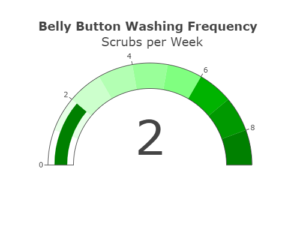

# Plot.ly-Challenge---Belly-Button-Biodiversity

I built an interactive dashboard to explore the [Belly Button Biodiversity dataset](http://robdunnlab.com/projects/belly-button-biodiversity/), which catalogs the microbes that colonize human navels.

The dataset reveals that a small handful of microbial species (also called operational taxonomic units, or OTUs, in the study) were present in more than 70% of people, while the rest were relatively rare.

## Plotly

1. Used the D3 library to read in `samples.json`.

2. Created a horizontal bar chart with a dropdown menu to display the top 10 OTUs found in that individual.

3. Created a bubble chart that displays each sample.

4. Displayed the sample metadata, i.e., an individual's demographic information.

5. Displayed each key-value pair from the metadata JSON object somewhere on the page.

6. Adapted the Gauge Chart to plot the weekly washing frequency of the individual.

7. Updated all of the plots any time that a new sample is selected.

## Files to use
HTML page:	index.html
 
JavaScript:	static/js/app.js 

